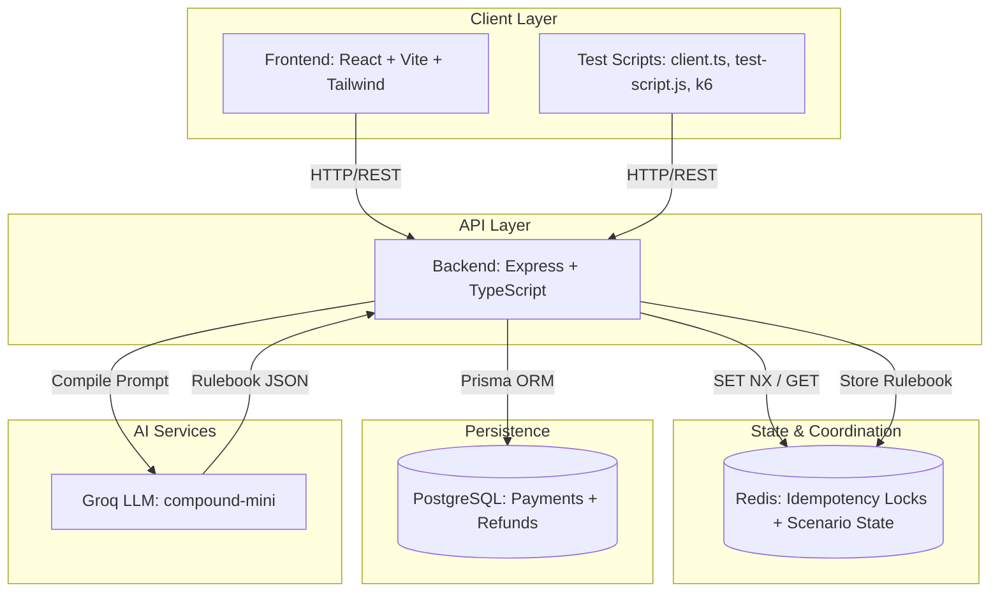
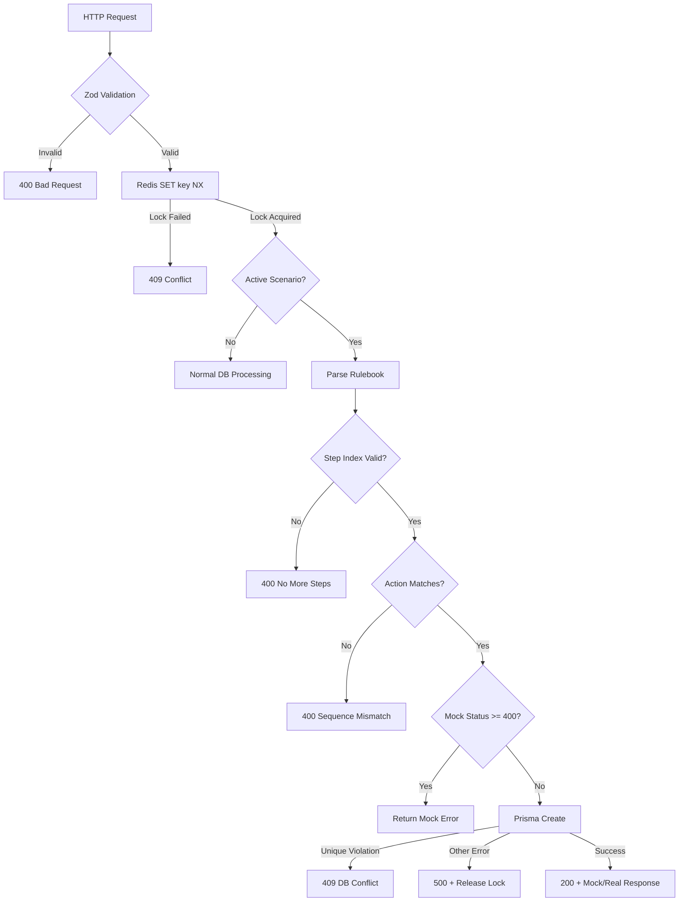
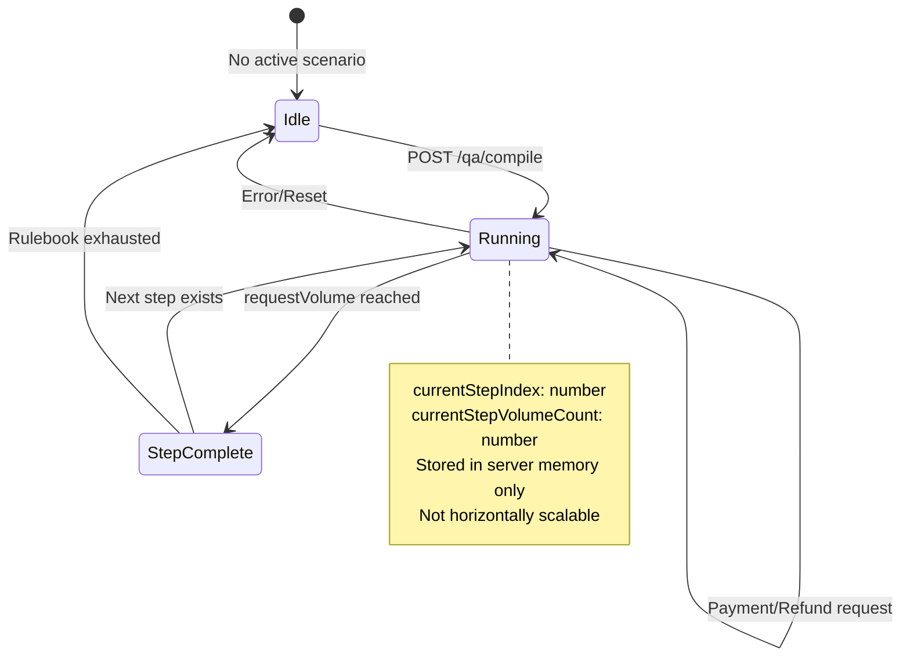
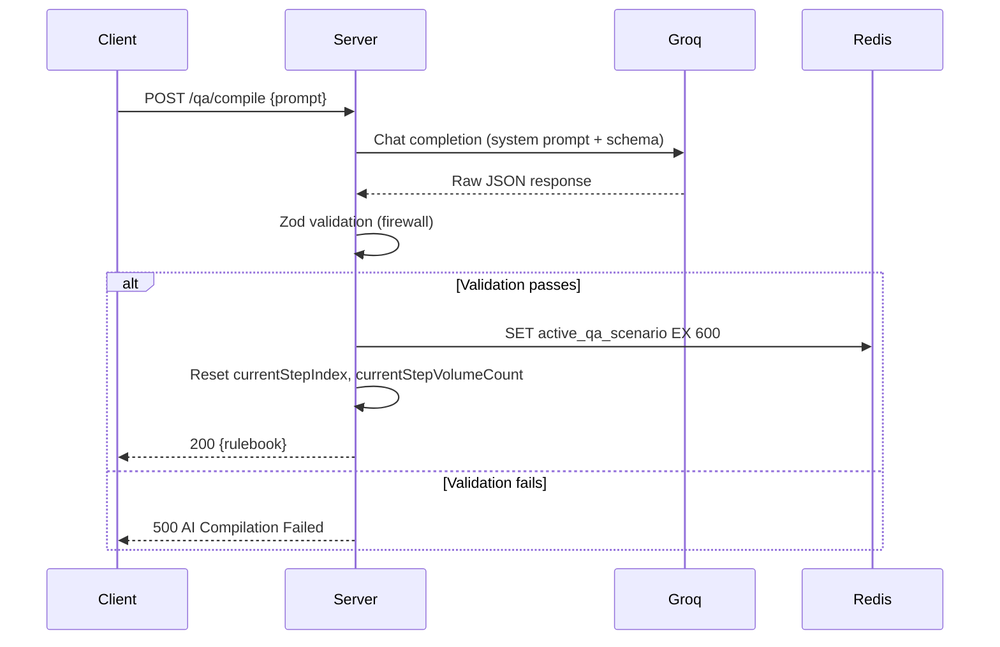
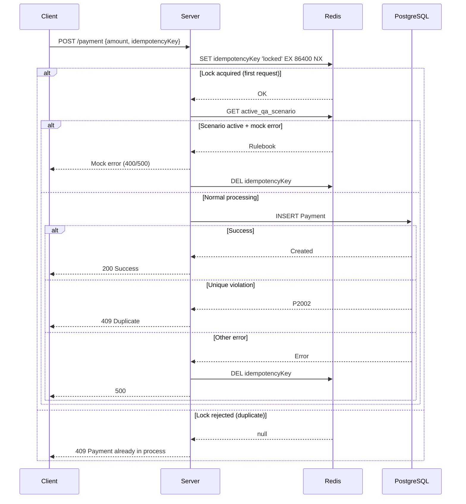
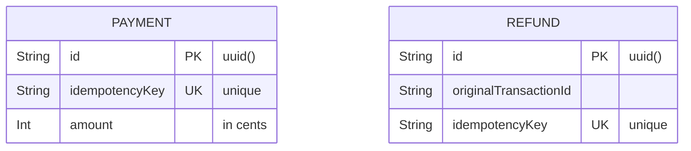
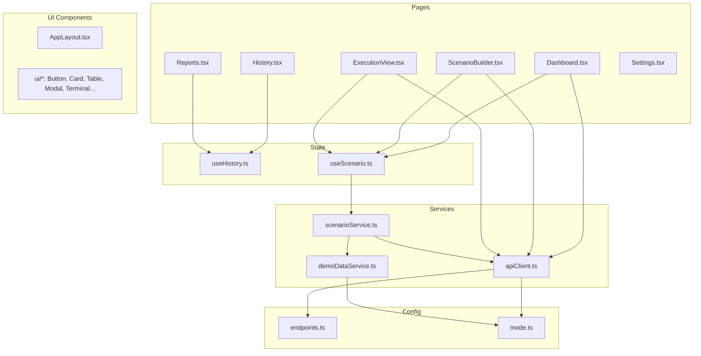
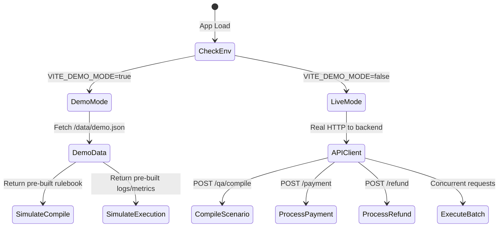
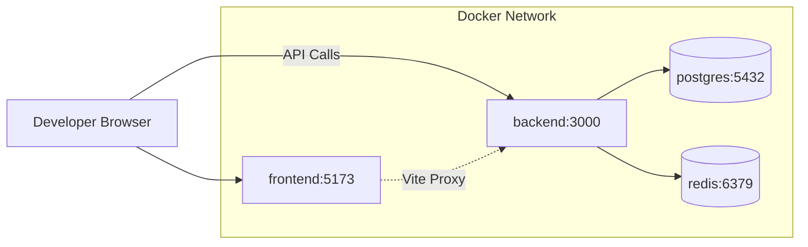
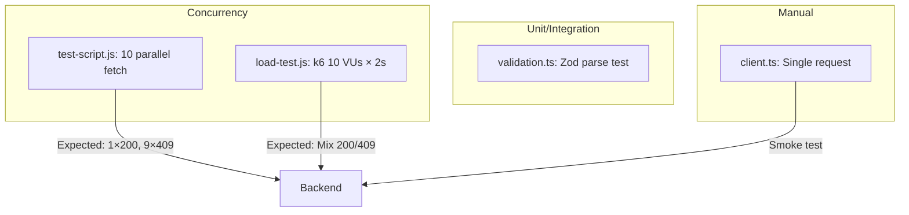

# Architecture Documentation

## System Overview

The Stateful AI-Driven Payment Engine is a concurrent payment gateway designed for QA testing of idempotency, race conditions, and failure scenarios. It consists of a TypeScript/Express backend with Redis-backed idempotency locks, PostgreSQL persistence via Prisma, and a React/Vite frontend for scenario building and execution visualization.

---

## High-Level Architecture



---

## Component Responsibilities

### Backend (`backend/src/`)

| Component | File | Responsibility |
|-----------|------|----------------|
| **Express Server** | `server.ts` | HTTP routing, middleware, global scenario state |
| **AI Compiler** | `ai-compiler.ts` | Natural language → validated JSON rulebook via Groq |
| **Validation** | `validation.ts` | Zod schemas (shared reference) |

#### Server.ts Key Flows



### Global Scenario State (In-Memory)



### AI Compiler Pipeline



### Idempotency Lock Mechanism



---

## Data Models

### Prisma Schema



### Redis Keys

| Key | Type | TTL | Purpose |
|-----|------|-----|---------|
| `{idempotencyKey}` | String | 86400s (24h) | Distributed lock for idempotency |
| `active_qa_scenario` | JSON String | 600s (10min) | Compiled rulebook for AI mode |

---

## Frontend Architecture (`frontend/src/`)



### Mode System



---

## Request/Response Contracts

### Compile Scenario
```
POST /qa/compile
Request:  { "prompt": "string" }
Response: { "message": "Compiled successfully", "rulebook": ScenarioStep[] }
Errors:   400 (no prompt), 500 (Groq/validation failure)
```

### Payment
```
POST /payment
Request:  { "amount": number, "idempotencyKey": "string" }
Success:  { "message": "Raw payment processed..." } or mock response
Errors:   400 (validation), 409 (Redis lock / DB unique), 500 (DB error)
```

### Refund
```
POST /refund
Request:  { "originalTransactionId": "string", "idempotencyKey": "string" }
Success:  { "message": "Raw refund processed..." } or mock response
Errors:   400 (validation), 409 (Redis lock / DB unique), 500 (DB error)
```

### Scenario Step Types

```typescript
// Payment Step
{
  stepId: string,
  action: "PAYMENT",
  amount: number,           // in cents
  requestVolume: number,    // how many requests for this step
  executionStrategy: "Sequential" | "Concurrent Attack",
  mockResponse: {
    httpStatus: number,     // 100-599
    body: { message: string }
  }
}

// Refund Step
{
  stepId: string,
  action: "REFUND",
  originalTransactionId: string,
  requestVolume: number,
  executionStrategy: "Sequential" | "Concurrent Attack",
  mockResponse: {
    httpStatus: number,
    body: { message: string }
  }
}
```

---

## Execution Strategies

| Strategy | Idempotency Keys | Use Case |
|----------|------------------|----------|
| **Sequential** | Unique per request (UUID) | Normal processing, all should succeed |
| **Concurrent Attack** | Same key for all requests | Stress test idempotency — expect 1× 200, N-1× 409 |

---

## Deployment Architecture

### Local Development (Docker Compose)



### Production Considerations

| Concern | Current State | Production Need |
|---------|---------------|-----------------|
| **Global State** | In-memory (`currentStepIndex`) | Redis-backed or single-instance only |
| **Horizontal Scaling** | Not supported | Sticky sessions or state externalization |
| **Redis** | Upstash (TLS) or local | Cluster mode for HA |
| **PostgreSQL** | Single instance | Read replicas, connection pooling |
| **AI Compiler** | Sync HTTP to Groq | Async job queue for reliability |

---

## Security Notes

- **CORS**: Configured for production Vercel + localhost:5173
- **Idempotency Keys**: 24h TTL in Redis, unique constraint in PostgreSQL
- **Validation**: Zod schemas on all inputs (guard clause pattern)
- **Environment**: Secrets via `.env` files (not committed)
- **Demo Mode**: Zero backend dependency — safe for public hosting

---

## Testing Architecture



---

## File Structure Reference

```
backend/
├── src/
│   ├── server.ts          # Express app, routes, global state
│   ├── ai-compiler.ts     # Groq + Zod compiler pipeline
│   └── validation.ts      # Zod schemas (reference)
├── prisma/
│   ├── schema.prisma      # Payment, Refund models
│   └── migrations/        # SQL migrations
├── Dockerfile
├── package.json
├── tsconfig.json
└── prisma.config.ts

frontend/
├── src/
│   ├── pages/             # Route components
│   ├── components/        # UI + layout
│   ├── services/          # API, demo data, scenario logic
│   ├── hooks/             # React state hooks
│   ├── config/            # Endpoints, mode detection
│   └── types/             # TypeScript interfaces
├── public/data/demo.json  # Demo scenarios (served by Vite)
├── Dockerfile
├── package.json
├── tsconfig.json
└── vite.config.ts

tests/
├── client.ts              # Single request test
├── test-script.js         # 10 concurrent (race condition)
├── load-test.js           # k6 load test
└── validation.ts          # Zod example

demo-datasets/
├── demo.json              # 6 scenarios + executions + rulebooks
└── rulebook.json          # Standalone rulebook example
```