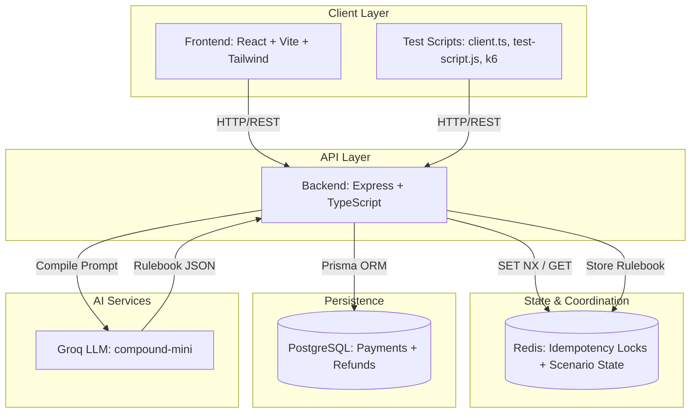

# Architecture Documentation

## System Overview

The Stateful AI-Driven Payment Engine is a concurrent payment gateway designed for QA testing of idempotency, race conditions, and failure scenarios. It consists of a TypeScript/Express backend with Redis-backed idempotency locks, PostgreSQL persistence via Prisma, and a React/Vite frontend for scenario building and execution visualization.

---

## High-Level Architecture

---

## Component Responsibilities

### Backend (`backend/src/`)

| Component | File | Responsibility |
|-----------|------|----------------|
| **Express Server** | `server.ts` | HTTP routing, middleware, global scenario state |
| **AI Compiler** | `ai-compiler.ts` | Natural language → validated JSON rulebook via Groq |
| **Validation** | `validation.ts` | Zod schemas (shared reference) |

